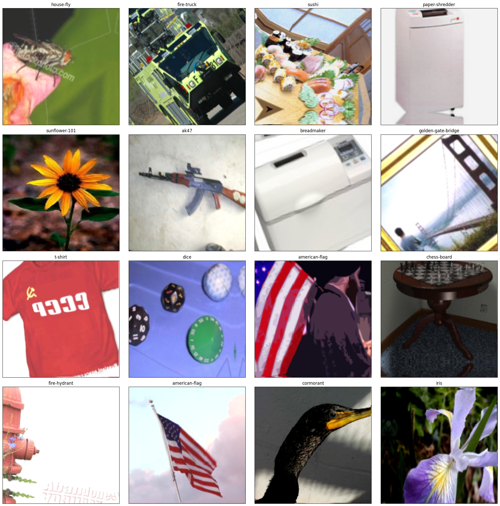
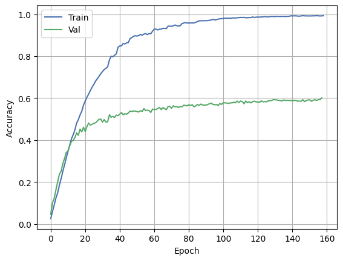
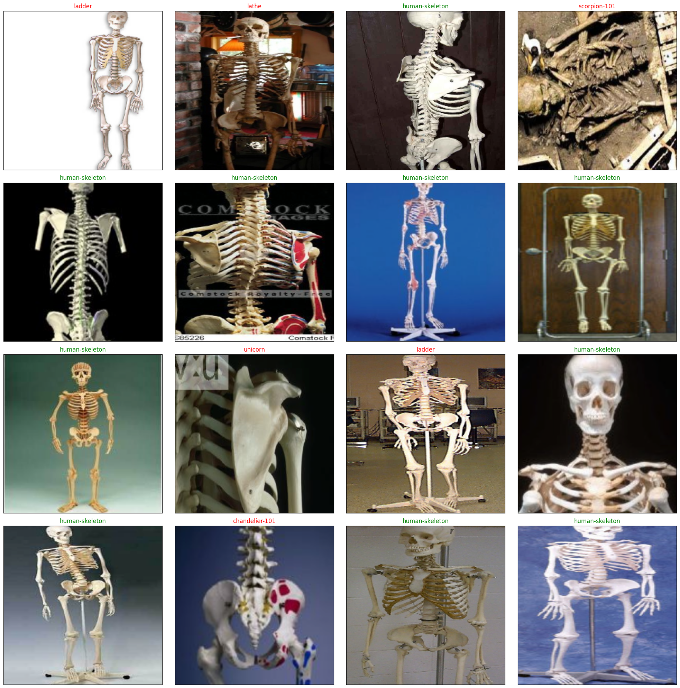

# Caltech-256 image classification using ResNet18

There are 30607 images in this [dataset](https://data.caltech.edu/records/nyy15-4j048) spanning 257 object categories. Object categories are extremely diverse, ranging from grasshopper to tuning fork. The distribution of images per category are:
+ Min: 80
+ Med: 100
+ Mean: 119
+ Max: 827

## ResNet18

The model was implemented according to the original [paper](https://arxiv.org/abs/1512.03385):
<details>
  <summary>
    Architecture (11689512 trainable parameters in total)
  </summary>
  
```
ResNet18(
  (conv1): Conv2d(3, 64, kernel_size=(7, 7), stride=(2, 2), padding=(3, 3), bias=False)
  (bn1): BatchNorm2d(64, eps=1e-05, momentum=0.1, affine=True, track_running_stats=True)
  (relu): ReLU()
  (maxpool): MaxPool2d(kernel_size=3, stride=2, padding=1, dilation=1, ceil_mode=False)
  (layer1): Sequential(
    (0): BuildingBlock(
      (conv1): Conv2d(64, 64, kernel_size=(3, 3), stride=(1, 1), padding=(1, 1), bias=False)
      (bn1): BatchNorm2d(64, eps=1e-05, momentum=0.1, affine=True, track_running_stats=True)
      (relu): ReLU(inplace=True)
      (conv2): Conv2d(64, 64, kernel_size=(3, 3), stride=(1, 1), padding=(1, 1), bias=False)
      (bn2): BatchNorm2d(64, eps=1e-05, momentum=0.1, affine=True, track_running_stats=True)
    )
    (1): BuildingBlock(
      (conv1): Conv2d(64, 64, kernel_size=(3, 3), stride=(1, 1), padding=(1, 1), bias=False)
      (bn1): BatchNorm2d(64, eps=1e-05, momentum=0.1, affine=True, track_running_stats=True)
      (relu): ReLU(inplace=True)
      (conv2): Conv2d(64, 64, kernel_size=(3, 3), stride=(1, 1), padding=(1, 1), bias=False)
      (bn2): BatchNorm2d(64, eps=1e-05, momentum=0.1, affine=True, track_running_stats=True)
    )
  )
  (layer2): Sequential(
    (0): BuildingBlock(
      (conv1): Conv2d(64, 128, kernel_size=(3, 3), stride=(2, 2), padding=(1, 1), bias=False)
      (bn1): BatchNorm2d(128, eps=1e-05, momentum=0.1, affine=True, track_running_stats=True)
      (relu): ReLU(inplace=True)
      (conv2): Conv2d(128, 128, kernel_size=(3, 3), stride=(2, 2), padding=(1, 1), bias=False)
      (bn2): BatchNorm2d(128, eps=1e-05, momentum=0.1, affine=True, track_running_stats=True)
      (downsample): Sequential(
        (0): Conv2d(64, 128, kernel_size=(1, 1), stride=(2, 2), bias=False)
        (1): BatchNorm2d(128, eps=1e-05, momentum=0.1, affine=True, track_running_stats=True)
      )
    )
    (1): BuildingBlock(
      (conv1): Conv2d(128, 128, kernel_size=(3, 3), stride=(1, 1), padding=(1, 1), bias=False)
      (bn1): BatchNorm2d(128, eps=1e-05, momentum=0.1, affine=True, track_running_stats=True)
      (relu): ReLU(inplace=True)
      (conv2): Conv2d(128, 128, kernel_size=(3, 3), stride=(1, 1), padding=(1, 1), bias=False)
      (bn2): BatchNorm2d(128, eps=1e-05, momentum=0.1, affine=True, track_running_stats=True)
    )
  )
  (layer3): Sequential(
    (0): BuildingBlock(
      (conv1): Conv2d(128, 256, kernel_size=(3, 3), stride=(2, 2), padding=(1, 1), bias=False)
      (bn1): BatchNorm2d(256, eps=1e-05, momentum=0.1, affine=True, track_running_stats=True)
      (relu): ReLU(inplace=True)
      (conv2): Conv2d(256, 256, kernel_size=(3, 3), stride=(2, 2), padding=(1, 1), bias=False)
      (bn2): BatchNorm2d(256, eps=1e-05, momentum=0.1, affine=True, track_running_stats=True)
      (downsample): Sequential(
        (0): Conv2d(128, 256, kernel_size=(1, 1), stride=(2, 2), bias=False)
        (1): BatchNorm2d(256, eps=1e-05, momentum=0.1, affine=True, track_running_stats=True)
      )
    )
    (1): BuildingBlock(
      (conv1): Conv2d(256, 256, kernel_size=(3, 3), stride=(1, 1), padding=(1, 1), bias=False)
      (bn1): BatchNorm2d(256, eps=1e-05, momentum=0.1, affine=True, track_running_stats=True)
      (relu): ReLU(inplace=True)
      (conv2): Conv2d(256, 256, kernel_size=(3, 3), stride=(1, 1), padding=(1, 1), bias=False)
      (bn2): BatchNorm2d(256, eps=1e-05, momentum=0.1, affine=True, track_running_stats=True)
    )
  )
  (layer4): Sequential(
    (0): BuildingBlock(
      (conv1): Conv2d(256, 512, kernel_size=(3, 3), stride=(2, 2), padding=(1, 1), bias=False)
      (bn1): BatchNorm2d(512, eps=1e-05, momentum=0.1, affine=True, track_running_stats=True)
      (relu): ReLU(inplace=True)
      (conv2): Conv2d(512, 512, kernel_size=(3, 3), stride=(2, 2), padding=(1, 1), bias=False)
      (bn2): BatchNorm2d(512, eps=1e-05, momentum=0.1, affine=True, track_running_stats=True)
      (downsample): Sequential(
        (0): Conv2d(256, 512, kernel_size=(1, 1), stride=(2, 2), bias=False)
        (1): BatchNorm2d(512, eps=1e-05, momentum=0.1, affine=True, track_running_stats=True)
      )
    )
    (1): BuildingBlock(
      (conv1): Conv2d(512, 512, kernel_size=(3, 3), stride=(1, 1), padding=(1, 1), bias=False)
      (bn1): BatchNorm2d(512, eps=1e-05, momentum=0.1, affine=True, track_running_stats=True)
      (relu): ReLU(inplace=True)
      (conv2): Conv2d(512, 512, kernel_size=(3, 3), stride=(1, 1), padding=(1, 1), bias=False)
      (bn2): BatchNorm2d(512, eps=1e-05, momentum=0.1, affine=True, track_running_stats=True)
    )
  )
  (avgpool): AdaptiveAvgPool2d(output_size=(1, 1))
  (fc): Linear(in_features=512, out_features=256, bias=True)
)
 ```

</details>

## Data augmentation

I used various augmentation techniques (such as ShiftScaleRotate, Blur, GridDistortion etc.) from [albumentations](https://github.com/albumentations-team/albumentations) to improve training process. Random sampled, denormilized training batch:



## Training results

The goal was to achieve 0.6+ accuracy on the validation set without any pretrained weights.



## Classification report

<details>
  <summary>
    Classification Report
  </summary>

```
                           precision    recall  f1-score   support

                     ak47       0.89      0.89      0.89        19
            american-flag       0.79      0.79      0.79        19
                 backpack       0.45      0.73      0.56        30
             baseball-bat       0.54      0.52      0.53        25
           baseball-glove       0.84      0.72      0.78        29
          basketball-hoop       0.79      0.61      0.69        18
                      bat       0.62      0.24      0.34        21
                  bathtub       0.61      0.50      0.55        46
                     bear       0.32      0.40      0.36        20
                 beer-mug       0.46      0.67      0.55        18
                billiards       0.72      0.91      0.81        55
               binoculars       0.64      0.81      0.71        43
                 birdbath       0.30      0.37      0.33        19
                    blimp       0.67      0.47      0.55        17
               bonsai-101       0.85      0.92      0.88        24
                 boom-box       0.50      0.61      0.55        18
             bowling-ball       0.33      0.40      0.36        20
              bowling-pin       0.62      0.50      0.56        20
             boxing-glove       0.36      0.42      0.38        24
                brain-101       0.71      0.62      0.67        16
               breadmaker       0.80      1.00      0.89        28
               buddha-101       0.65      0.79      0.71        19
                bulldozer       0.62      0.59      0.60        22
                butterfly       0.55      0.55      0.55        22
                   cactus       0.48      0.50      0.49        22
                     cake       0.50      0.38      0.43        21
               calculator       0.70      0.80      0.74        20
                    camel       0.31      0.23      0.26        22
                   cannon       0.25      0.10      0.14        20
                    canoe       0.38      0.15      0.21        20
                 car-tire       0.53      0.44      0.48        18
                  cartman       0.81      0.85      0.83        20
                       cd       0.54      0.65      0.59        20
                centipede       0.54      0.70      0.61        20
               cereal-box       0.40      0.59      0.48        17
           chandelier-101       0.62      0.71      0.67        21
              chess-board       0.77      0.83      0.80        24
                    chimp       0.39      0.41      0.40        22
               chopsticks       0.50      0.35      0.41        17
                cockroach       0.67      0.50      0.57        24
               coffee-mug       0.53      0.53      0.53        17
                   coffin       0.21      0.24      0.22        17
                     coin       0.47      0.67      0.55        24
                    comet       0.85      0.92      0.88        24
        computer-keyboard       0.62      0.47      0.53        17
         computer-monitor       0.59      0.62      0.60        26
           computer-mouse       0.30      0.33      0.32        18
                    conch       0.35      0.30      0.32        20
                cormorant       0.58      0.71      0.64        21
            covered-wagon       0.80      0.42      0.55        19
               cowboy-hat       0.29      0.45      0.35        22
                 crab-101       0.47      0.47      0.47        17
               desk-globe       0.74      0.88      0.80        16
             diamond-ring       0.86      0.78      0.82        23
                     dice       0.40      0.32      0.35        19
                      dog       0.25      0.10      0.14        20
              dolphin-101       0.48      0.52      0.50        21
                 doorknob       0.67      0.22      0.33        18
           drinking-straw       0.08      0.06      0.07        16
                     duck       0.28      0.29      0.29        17
                dumb-bell       0.33      0.25      0.29        20
             eiffel-tower       0.72      0.81      0.76        16
      electric-guitar-101       0.48      0.58      0.53        24
             elephant-101       0.43      0.69      0.53        26
                      elk       0.59      0.85      0.69        20
                 ewer-101       0.57      0.50      0.53        16
               eyeglasses       0.50      0.56      0.53        16
                     fern       0.84      0.73      0.78        22
              fighter-jet       0.35      0.37      0.36        19
        fire-extinguisher       0.62      0.62      0.62        16
             fire-hydrant       0.30      0.32      0.31        19
               fire-truck       0.70      0.83      0.76        23
                fireworks       0.85      0.85      0.85        20
               flashlight       0.27      0.17      0.21        23
              floppy-disk       0.29      0.12      0.17        16
          football-helmet       0.46      0.75      0.57        16
              french-horn       0.86      1.00      0.92        18
                fried-egg       0.93      0.78      0.85        18
                  frisbee       0.53      0.47      0.50        19
                     frog       0.21      0.13      0.16        23
               frying-pan       0.65      0.58      0.61        19
                   galaxy       0.79      0.69      0.73        16
                 gas-pump       0.33      0.32      0.32        19
                  giraffe       0.53      0.50      0.52        16
                     goat       0.32      0.27      0.29        22
       golden-gate-bridge       0.70      0.88      0.78        16
                 goldfish       0.50      0.56      0.53        18
                golf-ball       0.50      0.21      0.30        19
                    goose       0.38      0.27      0.32        22
                  gorilla       0.67      0.71      0.69        42
          grand-piano-101       0.71      0.79      0.75        19
                   grapes       0.69      0.88      0.77        40
              grasshopper       0.48      0.55      0.51        22
              guitar-pick       0.56      0.50      0.53        20
                hamburger       0.57      0.71      0.63        17
                  hammock       0.57      0.60      0.58        57
                harmonica       0.43      0.53      0.47        17
                     harp       0.37      0.50      0.43        20
              harpsichord       0.64      0.56      0.60        16
            hawksbill-101       0.67      0.78      0.72        18
              head-phones       0.77      0.63      0.69        27
           helicopter-101       0.67      0.59      0.62        17
                 hibiscus       0.75      0.82      0.78        22
            homer-simpson       0.68      0.79      0.73        19
                    horse       0.32      0.46      0.38        54
           horseshoe-crab       0.64      0.53      0.58        17
          hot-air-balloon       0.64      0.53      0.58        17
                  hot-dog       0.33      0.18      0.23        17
                  hot-tub       0.68      0.74      0.71        31
                hourglass       0.86      0.71      0.77        17
                house-fly       0.61      0.69      0.65        16
           human-skeleton       0.56      0.62      0.59        16
              hummingbird       0.71      0.52      0.60        23
                 ibis-101       0.60      0.62      0.61        24
           ice-cream-cone       0.40      0.24      0.30        17
                   iguana       0.32      0.29      0.30        21
                     ipod       0.82      0.75      0.78        24
                     iris       0.79      0.52      0.63        21
             jesus-christ       0.35      0.35      0.35        17
                joy-stick       0.72      0.50      0.59        26
             kangaroo-101       0.71      0.62      0.67        16
                    kayak       0.43      0.45      0.44        20
                ketch-101       0.84      0.73      0.78        22
             killer-whale       0.60      0.33      0.43        18
                    knife       0.14      0.15      0.14        20
                   ladder       0.36      0.31      0.33        48
               laptop-101       0.66      0.76      0.70        25
                    lathe       0.38      0.57      0.45        21
             leopards-101       0.86      0.97      0.91        38
            license-plate       0.68      0.72      0.70        18
                lightbulb       0.75      0.67      0.71        18
              light-house       0.61      0.66      0.63        38
                lightning       0.75      0.89      0.81        27
                llama-101       0.35      0.57      0.43        23
                  mailbox       0.18      0.11      0.14        18
                 mandolin       0.82      0.50      0.62        18
                     mars       0.86      0.97      0.91        31
                 mattress       0.44      0.63      0.52        38
                megaphone       0.45      0.29      0.36        17
              menorah-101       0.73      0.94      0.82        17
               microscope       0.44      0.65      0.53        23
                microwave       0.46      0.62      0.53        21
                  minaret       0.71      0.58      0.64        26
                 minotaur       0.86      0.38      0.52        16
           motorbikes-101       0.99      0.98      0.99       159
            mountain-bike       0.70      0.44      0.54        16
                 mushroom       0.53      0.45      0.49        40
                  mussels       0.52      0.65      0.58        34
                  necktie       0.50      0.40      0.44        20
                  octopus       0.46      0.27      0.34        22
                  ostrich       0.67      0.67      0.67        21
                      owl       0.77      0.42      0.54        24
               palm-pilot       0.68      0.72      0.70        18
                palm-tree       0.64      0.90      0.75        20
                paperclip       0.71      0.28      0.40        18
           paper-shredder       0.67      0.53      0.59        19
                 pci-card       0.73      0.76      0.74        21
                  penguin       0.63      0.66      0.64        29
                   people       0.36      0.44      0.40        41
            pez-dispenser       0.82      0.88      0.85        16
              photocopier       0.73      0.80      0.76        20
             picnic-table       0.42      0.28      0.33        18
             playing-card       0.20      0.22      0.21        18
                porcupine       0.63      0.60      0.62        20
                     pram       0.40      0.24      0.30        17
           praying-mantis       0.40      0.22      0.29        18
                  pyramid       0.54      0.41      0.47        17
                  raccoon       0.63      0.68      0.66        28
          radio-telescope       0.45      0.50      0.47        18
                  rainbow       0.68      0.85      0.76        20
             refrigerator       0.60      0.56      0.58        16
             revolver-101       0.67      0.84      0.74        19
                    rifle       0.29      0.10      0.14        21
             rotary-phone       0.67      0.62      0.65        16
           roulette-wheel       0.67      0.62      0.65        16
                   saddle       0.46      0.50      0.48        22
                   saturn       0.84      0.84      0.84        19
               school-bus       0.80      0.84      0.82        19
             scorpion-101       0.40      0.62      0.49        16
              screwdriver       0.58      0.35      0.44        20
                   segway       0.68      0.65      0.67        20
self-propelled-lawn-mower       0.84      0.88      0.86        24
                  sextant       0.69      0.55      0.61        20
              sheet-music       0.73      0.69      0.71        16
               skateboard       0.22      0.10      0.14        20
                    skunk       0.70      0.88      0.78        16
               skyscraper       0.65      0.58      0.61        19
               smokestack       0.48      0.65      0.55        17
                    snail       0.60      0.39      0.47        23
                    snake       0.27      0.18      0.22        22
                  sneaker       0.33      0.32      0.33        22
               snowmobile       0.59      0.73      0.65        22
              soccer-ball       0.44      0.50      0.47        34
                    socks       0.31      0.36      0.33        22
                 soda-can       0.10      0.12      0.11        17
                spaghetti       0.73      0.80      0.76        20
               speed-boat       0.56      0.45      0.50        20
                   spider       0.33      0.24      0.28        21
                    spoon       0.36      0.24      0.29        21
            stained-glass       0.45      0.45      0.45        20
             starfish-101       0.83      0.62      0.71        16
           steering-wheel       0.74      0.74      0.74        19
                 stirrups       0.46      0.33      0.39        18
            sunflower-101       1.00      1.00      1.00        16
                 superman       0.87      0.76      0.81        17
                    sushi       0.76      0.68      0.72        19
                     swan       0.48      0.65      0.56        23
         swiss-army-knife       0.86      0.90      0.88        21
                    sword       0.46      0.55      0.50        20
                  syringe       0.53      0.45      0.49        22
               tambourine       0.59      0.53      0.56        19
                   teapot       0.54      0.70      0.61        27
               teddy-bear       0.53      0.45      0.49        20
                   teepee       0.57      0.85      0.69        27
            telephone-box       0.77      0.62      0.69        16
              tennis-ball       0.57      0.63      0.60        19
             tennis-court       0.61      0.67      0.64        21
            tennis-racket       0.53      0.56      0.55        16
               theodolite       0.55      0.38      0.44        16
                  toaster       0.74      0.78      0.76        18
                   tomato       0.80      0.60      0.69        20
                tombstone       0.46      0.67      0.55        18
                  top-hat       0.41      0.56      0.47        16
             touring-bike       0.63      0.77      0.69        22
               tower-pisa       0.79      0.83      0.81        18
            traffic-light       0.67      0.42      0.52        19
                treadmill       0.56      0.66      0.60        29
              triceratops       0.58      0.74      0.65        19
                 tricycle       0.47      0.42      0.44        19
            trilobite-101       0.67      0.89      0.76        18
                   tripod       0.81      0.59      0.68        22
                  t-shirt       0.58      0.61      0.59        71
              tuning-fork       0.50      0.30      0.37        20
                  tweezer       0.65      0.71      0.68        24
             umbrella-101       0.71      0.68      0.70        22
                  unicorn       0.38      0.26      0.31        19
                      vcr       0.82      0.78      0.80        18
          video-projector       0.79      0.79      0.79        19
          washing-machine       0.73      0.50      0.59        16
                watch-101       0.77      0.90      0.83        40
                waterfall       0.72      0.68      0.70        19
               watermelon       0.65      0.61      0.63        18
             welding-mask       0.61      0.61      0.61        18
              wheelbarrow       0.25      0.17      0.20        18
                 windmill       0.42      0.44      0.43        18
              wine-bottle       0.54      0.35      0.42        20
                xylophone       0.43      0.56      0.49        18
                 yarmulke       0.70      0.88      0.78        16
                    yo-yo       0.33      0.35      0.34        20
                    zebra       0.74      0.74      0.74        19
            airplanes-101       0.93      0.97      0.95       160
             car-side-101       0.92      1.00      0.96        23
           faces-easy-101       0.98      0.99      0.98        87
                greyhound       0.27      0.16      0.20        19
             tennis-shoes       0.50      0.35      0.41        20
                     toad       0.56      0.43      0.49        21

                 accuracy                           0.60      5862
                macro avg       0.58      0.57      0.56      5862
             weighted avg       0.60      0.60      0.59      5862
```
</details>

## Results



## Usage

```
options:
  -h, --help            show this help message and exit
  -t, --train           switch to training mode
  -b, --batch_size      set batch size
  -e, --epoch           set epochs number
  -l, --learning_rate   set learning rate
  -p, --params_path     set path to pretrained params
```

</details>

### Training

To train model, run the following command:

```bash
$ python main.py -t --batch_size BATCH_SIZE --epoch EPOCH --learning_rate LR
```

### Inference 

To evaluate the trained model, run:

```bash
$ python main.py
Inference mode
Path to image: 256_ObjectCategories/224.touring-bike/224_0001.jpg           
Top 5 predictions:
1. touring-bike = 100.000%
2. tricycle = 0.000%
3. mountain-bike = 0.000%
4. teapot = 0.000%
5. wine-bottle = 0.000%
```

## ONNX

The model was successfully converted to the ONNX format and evaluated with ONNXRuntime. All metrics align perfectly with those of the original model.